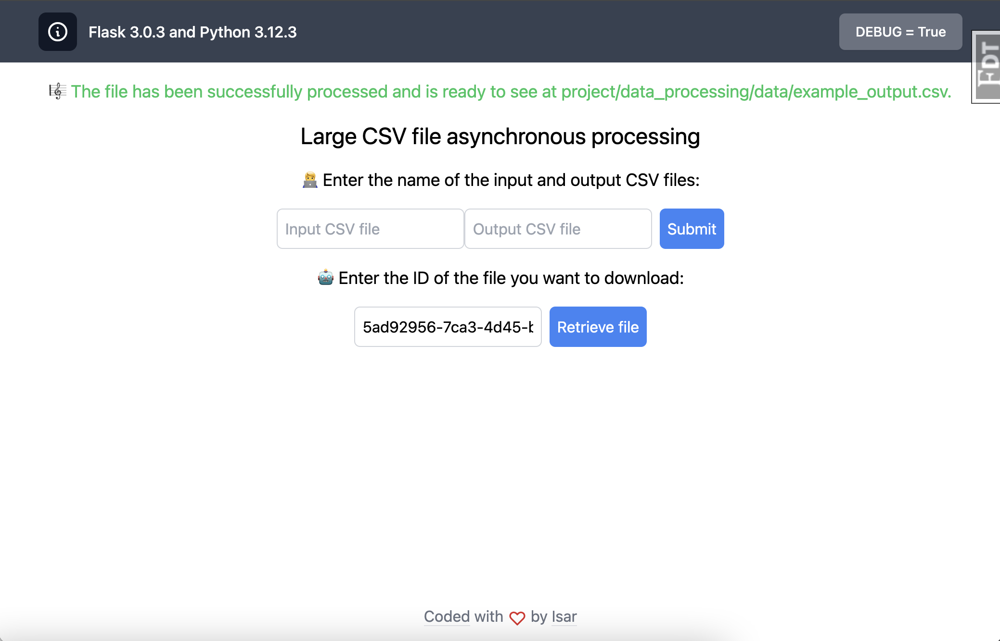

# Large file asynchronous processing

**This app is using Flask 3.0.3 and Python 3.12.3**.



## Tech stack

### Back-end

- [Redis](https://redis.io/)
- [Celery](https://github.com/celery/celery)

### Front-end

- [esbuild](https://esbuild.github.io/)
- [TailwindCSS](https://tailwindcss.com/)
- [Heroicons](https://heroicons.com/)

## Running this app

You'll need to have [Docker installed](https://docs.docker.com/get-docker/).
It's available on Windows, macOS and most distros of Linux.

You'll also need to enable Docker Compose v2 support if you're using Docker
Desktop. On native Linux without Docker Desktop you can [install it as a plugin
to Docker](https://docs.docker.com/compose/install/linux/). 

If you're using Windows, it will be expected that you're inside of WSL or WSL 2.

#### Clone this repo anywhere you want and move into the directory:

```sh
git clone https://github.com/fridisar/async-assignment
cd async-assignment
```

#### Copy an example .env file because the real one is git ignored:

```sh
cp .env.example .env
```

#### Build everything:

*The first time you run this it's going to take 5-10 minutes depending on your
internet connection speed and computer's hardware specs. That's because it's
going to download a few Docker images and build the Python + Yarn dependencies.*

```sh
docker compose up --build
```

Did you receive a `depends_on` "Additional property required is not allowed"
error? Please update to at least Docker Compose v2.20.2+ or Docker Desktop
4.22.0+.

Did you receive an error about a port being in use? Chances are it's because
something on your machine is already running on port 8000. Check out the docs
in the `.env` file for the `DOCKER_WEB_PORT_FORWARD` variable to fix this.

Did you receive a permission denied error? Chances are you're running native
Linux and your `uid:gid` aren't `1000:1000` (you can verify this by running
`id`). Check out the docs in the `.env` file to customize the `UID` and `GID`
variables to fix this.

#### Check it out in a browser:

Visit <http://localhost:8000> in your favorite browser.

#### Try its processing functionality:

* Go to the [`project/data_processing/data/csv/`](project/data_processing/data/csv/) folder.
* There you'll see csv files such as `example_input.csv`
* In the main page on <http://localhost:8000> you can enter the file name of an existing CSV in the input field and any CSV filename (existing or not) in the output field. Then click submit.
* If you want to create a larger dataset to see asynchronous and memory behaviour you can run `generate_big_dataset.py` and use the generated `very_large_data.csv` as the input.

#### Try its asynchronous functionality:

* In the main page on <http://localhost:8000>, after submitting any existing input file you'll get a task ID (ex: `75499481-c54f-4ab5-a591-75d935e1e764`). You will see the ID at the top and it will be automatically inserted in the ID field below.
* Click on retrieve file to get retrieval status.

#### Linting the code base:

```sh
./run lint
```

#### Sorting Python imports in the code base:

```sh
./run format:imports
```

#### Formatting the code base:

```sh
./run format
```

*There's also a `./run quality` command to run the above 3 commands together.*

#### Running the test suite:

```sh
# You should see all passing tests. Warnings are typically ok.
./run test
```

#### Stopping everything:

```sh
# Stop the containers and remove a few Docker related resources associated to this project.
docker compose down
```

You can start things up again with `docker compose up` and unlike the first
time it should only take seconds.

### `.env`

This file is ignored from version control so it will never be commit. There's a
number of environment variables defined here that control certain options and
behavior of the application. Everything is documented there.

### `run`

You can run `./run` to get a list of commands and each command has
documentation in the `run` file itself.

It's a shell script that has a number of functions defined to help you interact
with this project. 

## Notable opinions and extensions

- **Packages and extensions**:
    - *[gunicorn](https://gunicorn.org/)* for an app server in both development and production
    - *[Flask-DebugToolbar](https://github.com/flask-debugtoolbar/flask-debugtoolbar)* to show useful information for debugging
- **Linting, formatting and testing**:
    - *[flake8](https://github.com/PyCQA/flake8)* is used to lint the code base
    - *[isort](https://github.com/PyCQA/isort)* is used to auto-sort Python imports
    - *[black](https://github.com/psf/black)* is used to format the code base
    - *[pytest](https://github.com/pytest-dev/pytest)* and *pytest-cov* for writing tests and reporting test coverage
- **Blueprints**:
    - Add `page` blueprint to render a `/` page
    - Add `up` blueprint to provide a few health check pages
- **Config**:
    - Log to STDOUT so that Docker can consume and deal with log output 
    - Extract a bunch of configuration settings into environment variables
    - `config/settings.py` and the `.env` file handles configuration in all environments
- **Front-end assets**:
    - `assets/` contains all the CSS, JS, images, fonts, etc. and is managed by esbuild
- **Flask defaults that are changed**:
    - `public/` is the static directory where Flask will serve static files from
    - `static_url_path` is set to `""` to remove the `/static` URL prefix for static files
    - `ProxyFix` middleware is enabled (check `project/app.py`)

#### Official documentation 

- <https://docs.docker.com/>
- <https://flask.palletsprojects.com/>


#### Big thanks to Nick Janetakis <https://nickjanetakis.com> for the Docker + Flask template
